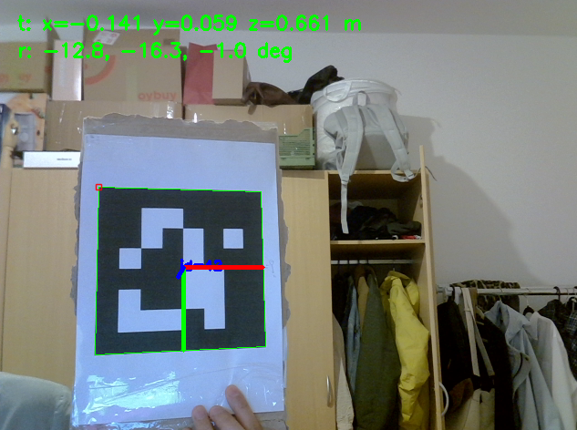
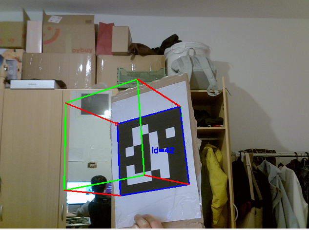
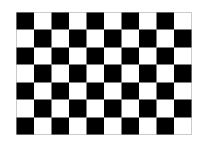
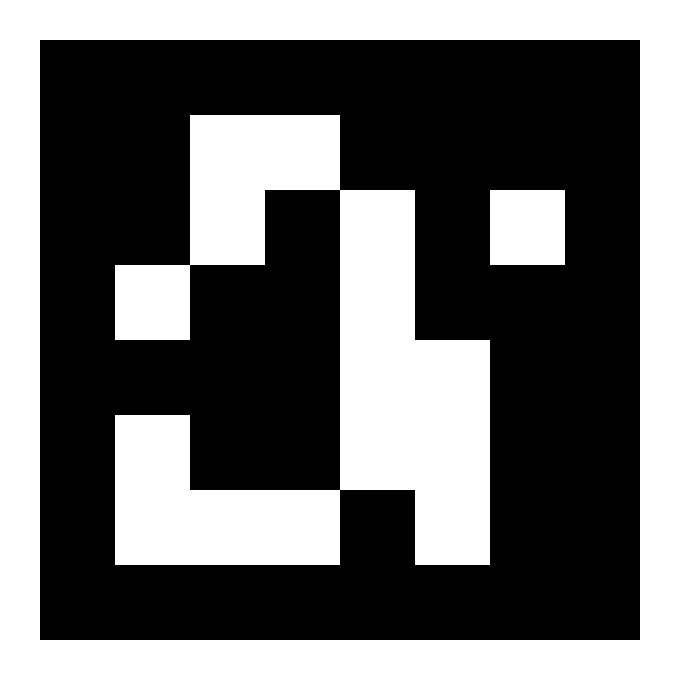

# Simple ArUco Pose Estimation

Learning project for estimating the pose of a printed ArUco marker with a real
camera, OpenCV's ArUco detector, and `solvePnP`.

## Pipeline

This project is used to estimate a marker's 6DoF pose in the camera frame:

```text
position:    x, y, z
orientation: rotation
```

The workflow is:

```text
1. Capture chessboard images for camera calibration
        ↓
2. Calibrate the camera to get K and D
        ↓
3. Generate and print an ArUco marker
        ↓
4. Detect the marker in the camera image
        ↓
5. Use solvePnP to estimate the marker's 6D pose
```

In short:

```text
known marker size + detected marker corners + calibrated camera parameters
        ↓
marker pose in camera frame
```

## Example Result



The colored outline is the detected marker boundary. The red dot marks the first
corner in ArUco order: top-left. The axes and text overlay show the estimated
pose: `tvec` is marker position in the camera frame, and `rvec` is marker
orientation.

## Cube on Marker Result



This example is used to learn `cv2.projectPoints`. The cube corners are defined
as 3D points in the marker/object coordinate frame, then projected into the
camera's 2D image view. The cube is not physically present; it is drawn from the
projected 2D points.

Camera-frame convention:

```text
x: right in the image
y: down in the image
z: forward from the camera
```

Marker corner order:

```text
top-left -> top-right -> bottom-right -> bottom-left
```

The current setup uses:

- Logitech C270 camera at `640 x 480`, camera index `2`
- ArUco dictionary `DICT_6X6_250`
- marker id `42`
- marker physical side length `174 mm = 0.174 m`
- chessboard calibration target with `9 x 6` inner corners
- measured chessboard square size `23.5 mm = 0.0235 m`

## Requirements

Install the Python dependencies:

```bash
pip install opencv-contrib-python numpy
```

Use a camera and two printed targets: one chessboard for camera calibration, and
one ArUco marker for pose estimation.

Calibration chessboard:



OpenCV uses the chessboard's inner corners for calibration. An inner corner is a
point inside the board where four squares meet. This board has `10 x 7` squares,
so it has `9 x 6` inner corners.

ArUco marker:



The marker comes from OpenCV's `DICT_6X6_250` ArUco dictionary. The detector
finds the marker's four outer corners, then reads the inner black/white pattern
to identify the marker id.

Print both targets at actual size. After printing, measure them manually:

- measure one chessboard square; this project uses `23.5 mm`
- measure the ArUco marker side length; this project uses `174 mm`

Use the measured values in the scripts, not only the intended print size.

## Layout

```text
src/
  capture_calibration_images.py   capture chessboard images from the camera
  calibrate_camera.py             compute K and D from saved chessboard images
  aruco_pose_from_camera.py       detect marker 42 and estimate pose
  cube_on_aruco_marker.py         draw a virtual cube using the marker pose

scripts/
  generate_marker.py              generate marker image
  generate_chessboard.py          generate printable chessboard SVG

images/
  calibration/                    captured chessboard images
  targets/                        generated marker/chessboard files

config/
  camera_calibration.yaml         calibrated camera matrix and distortion
```

## 1. Capture Calibration Images

First capture images of the printed chessboard:

```bash
python3 src/capture_calibration_images.py
```

Controls:

- `s`: save an image when the chessboard is detected
- `q` or `Esc`: quit

Save around `15-30` good views. Move the chessboard around the image: center,
left, right, top, bottom, close, far, and tilted.

Images are saved to:

```text
images/calibration/
```

## 2. Calibrate Camera

Use the saved chessboard images to calculate the camera parameters:

```bash
python3 src/calibrate_camera.py
```

This computes:

```text
K = camera matrix
D = distortion coefficients
```

and saves:

```text
config/camera_calibration.yaml
```

The current calibration result is approximately:

```text
K =
[[676.6783,   0.0000, 345.7916],
 [  0.0000, 677.3407, 236.5076],
 [  0.0000,   0.0000,   1.0000]]

D =
[0.0112, 0.2488, -0.0044, 0.0064, -0.3864]

RMS reprojection error = 0.8212 px
```

## 3. Generate Printable Targets

```bash
python3 scripts/generate_marker.py
python3 scripts/generate_chessboard.py
```

Outputs:

```text
images/targets/marker_6x6_id42.png
images/targets/chessboard_9x6_25mm.svg
```

The printed chessboard was measured after printing, so calibration uses the real
square size:

```text
23.5 mm
```

## 4. Estimate ArUco Marker Pose

```bash
python3 src/aruco_pose_from_camera.py
```

The script:

1. loads `config/camera_calibration.yaml`
2. opens camera `2`
3. detects ArUco marker id `42`
4. builds the marker's known 3D corner points using side length `0.174 m`
5. runs `cv2.solvePnP`
6. draws the marker axes and prints `tvec`/`rvec`

`tvec` is the marker center position in the camera frame:

```text
x: right in the image
y: down in the image
z: forward from the camera
```

## 5. Draw a Cube on the Marker

```bash
python3 src/cube_on_aruco_marker.py
```

This script starts with the same pose estimation steps, then focuses on one more
idea: using `cv2.projectPoints` to project a 3D object from the marker/object
coordinate frame into the camera's 2D image view.

```text
3D cube corners in object frame + rvec/tvec + camera K and D
        ↓
2D cube corners in the camera image
        ↓
draw cube edges
```

The bottom face of the cube lies on the marker plane. The cube height is the
same as the marker side length.

## Core Idea

Calibration answers:

```text
What are this camera's intrinsic parameters?
```

Pose estimation answers:

```text
Where is the marker relative to this camera?
```

The pose pipeline is:

```text
known marker 3D corners
        +
detected marker 2D image corners
        +
camera K and D
        ↓
solvePnP
        ↓
rvec and tvec
```
